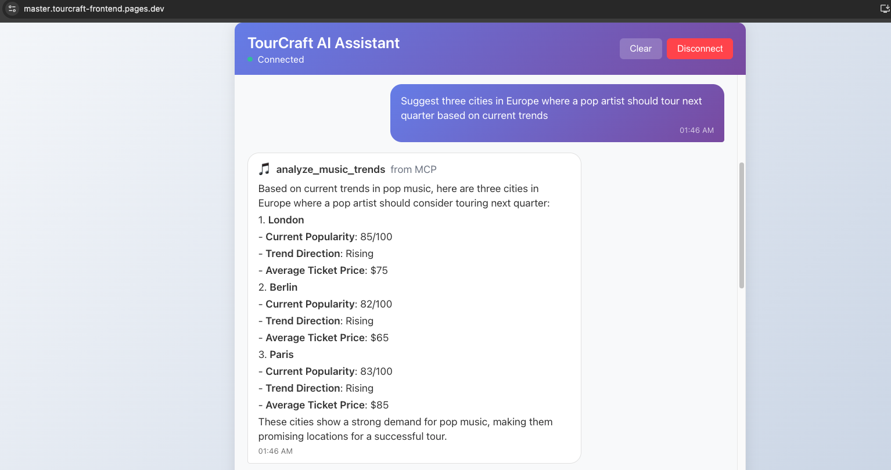

## TourCraft

An AI-powered assistant to help managers of singers and pop stars plan tours based on music trends across locations. The long-term vision includes trend analysis, venue research, coordination with band members, and logistics.

This repository contains:
- A React frontend hosted on Cloudflare Pages
- A Cloudflare Worker backend with WebSocket chat and Durable Object memory
- Experimental MCP servers (mock) and an MCP client to evolve into a modular architecture

### Live Frontend (for reference)
You can access the current frontend here: [TourCraft Frontend](https://master.tourcraft-frontend.pages.dev/)

Note: The deployment link is provided for convenience. This README focuses on local setup and deployment steps rather than production URLs.

---

## Project Goals and Current Status

### Big Picture (Plan)
- Build a conversational assistant that plans tours using music trend signals across locations
- Research venues in those candidate locations
- Share plans with band members and coordinate schedules/logistics
- Scale via a modular MCP architecture where specialized servers handle domains like music trends, venues, budgeting, logistics, etc.

### What’s Implemented So Far
- React frontend (Cloudflare Pages) with a real-time chat UI
- Cloudflare Worker backend with WebSocket support
- Durable Object for basic conversation memory
- Initial MCP exploration: we hit client/server connectivity issues, so we built a minimal `simple-calculator-mcp` to validate the pipeline and then moved on to the mock `music-trends-mcp` server.

### Near-Term Roadmap
- Replace mock Music Trends MCP server with real data sources:
  - Integrate Spotify and YouTube APIs for actual trend analysis
- Improve conversation memory and error handling
- Expand MCP servers: Venues, Budgeting, Band Coordination, Logistics

---

## Repository Structure
```
TourCraft/
├── src/                      # Cloudflare Worker (backend)
│   └── index.ts              # Worker entry (WebSocket + Durable Object)
├── pages/                    # React frontend (Cloudflare Pages)
│   ├── src/
│   ├── public/
│   └── package.json
├── music-trends-mcp/         # Mock MCP server (to be replaced by real APIs)
│   └── src/
├── wrangler.jsonc            # Worker config
├── plan.md                   # Architecture and roadmap
└── README.md                 # This file
```

---

## Prerequisites
- Node.js 18+ and npm (or pnpm/yarn)
- Cloudflare account
- Wrangler CLI (`npm i -g wrangler`)
- OpenAI API key (required for the chat and MCP integrations)

---

## Environment Variables

### Cloudflare Workers
- Configure your `wrangler.jsonc` with your `account_id`.
- If using Durable Objects, ensure migrations are defined and run by Wrangler when deploying.

### OpenAI (mandatory)
Set your OpenAI API key for local dev and deployment:
```
export OPENAI_API_KEY="sk-..."
```
Or configure it as a secret/environment variable in your deployment environment (e.g., `wrangler secret put OPENAI_API_KEY`).

---

## Frontend (Cloudflare Pages) — React App

1) Install dependencies
```
cd pages
npm install
```

2) Run locally
```
npm start
```

3) Build
```
npm run build
```

4) Deploy to Cloudflare Pages
- Create a Pages project pointing to the `pages/` directory
- Set build command to `npm run build` and output directory (e.g., `build`)

The frontend expects a WebSocket endpoint for the backend (config and UI are already wired for a Worker-based WS server).

### Quick Chat Examples
Type messages like these in the chat to get started:
- "Suggest three cities in Europe where a pop artist should tour next quarter based on current trends."
- "Compare London vs. Berlin for audience interest in pop over the last 6 months."
- "Summarize the key genres trending in New York."

---

## Preview



---

## Backend (Cloudflare Worker) — WebSocket + Durable Object + OpenAI

1) Install dependencies at repo root
```
npm install
```

2) Configure `wrangler.jsonc`
- Ensure `account_id` is set
- Verify Durable Object configuration (names, classes) if present

3) Develop locally
```
wrangler dev
```

4) Deploy
```
wrangler deploy
```

The Worker exposes a WebSocket endpoint used by the frontend chat and leverages Durable Objects for conversation memory. It uses OpenAI via `OPENAI_API_KEY` to generate responses.

---

## MCP Servers

### Music Trends MCP (mock; to be replaced)
- Location: `music-trends-mcp/`
- Purpose: Prototype interface for analyzing music trends across locations
- Next step: Replace mock data with real Spotify and YouTube integrations

Run locally:
```
cd music-trends-mcp
npm install
wrangler dev
```

---

## Development Notes
- Start the backend first (so the WebSocket server is available), then run the frontend.
- The frontend connects to the Worker over WebSockets; verify the WS URL if you customize routes.
- For Durable Objects, confirm migrations are applied in Wrangler before testing persistence.

---

## Roadmap
- Replace mock Music Trends MCP with real Spotify/YouTube API integrations for trend analysis
- Add Venue Research MCP (availability, pricing), Budget Planning MCP, Band Coordination MCP, Logistics MCP
- Strengthen conversation memory, error handling, and reconnection behavior
- Add end-to-end tests and load testing for WS + DO flows

---

## Acknowledgements and Scope
This project is motivated by Cloudflare's agents-starter work and adapts similar ideas to a custom setup.
It is not a full-fledged product; it is a demonstration showing how MCP can be used on Cloudflare (Workers + Pages) with a simple chat UI and mock servers.

---


